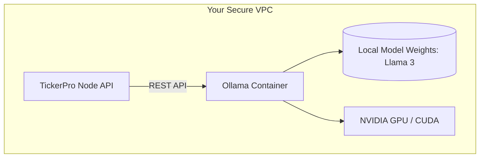

# TickerPro Local LLM Deployment Guide

For data-sensitive verticals like BFSI (Banking, Financial Services, and Insurance) and Healthcare, sending customer PII or sensitive financial data to public cloud APIs like OpenAI or Anthropic is often a compliance violation (e.g., GDPR, HIPAA, SOC2 data residency requirements).

TickerPro solves this by offering a native **Local LLM architecture** powered by [Ollama](https://ollama.ai/), enabling you to run state-of-the-art AI models entirely within your own Virtual Private Cloud (VPC) or bare-metal servers.

---

## Architecture Overview

In a typical cloud deployment, TickerPro relies on OpenAI for the AI Copilot features (Message Summarization, Smart Replies, Sentiment Analysis). In a Local LLM deployment, the architecture shifts to:



By keeping the Ollama container within the same VPC, **no chat data ever leaves your infrastructure**.

---

## Prerequisites

To run LLMs locally with acceptable inference speeds for a CRM:
- **Compute**: A server with at least 16GB RAM.
- **GPU**: NVIDIA GPU with at least 8GB VRAM (e.g., RTX 3090, A10g, T4) is highly recommended. CPU inference is possible but not suitable for production response times.
- **Docker**: For running the Ollama service alongside TickerPro.

---

## Setup Instructions

### 1. Start the Ollama Service

Update your `docker-compose.yml` to include the Ollama service. TickerPro provides an official container for this.

```yaml
services:
  ollama:
    image: ollama/ollama:latest
    ports:
      - "11434:11434"
    volumes:
      - ollama_data:/root/.ollama
    deploy:
      resources:
        reservations:
          devices:
            - driver: nvidia
              count: 1
              capabilities: [gpu]
```

### 2. Download the Models

Once the container is running, execute the container to download the required models. We recommend **Llama 3 (8B)** for the best balance of speed and instruction-following capability.

```bash
docker exec -it tickerpro-ollama ollama run llama3
```

### 3. Configure TickerPro

Update your TickerPro environment variables in `.env` to point the AI service to your local Ollama instance instead of OpenAI:

```env
# AI Configuration
AI_PROVIDER=ollama
OLLAMA_URL=http://ollama:11434
OLLAMA_MODEL=llama3
```

Restart your TickerPro API service:
```bash
docker-compose restart api
```

---

## Validation

To verify the setup, open the TickerPro dashboard:
1. Open any long WhatsApp conversation.
2. Click the **"✨ Summarize"** button in the Copilot pane.
3. Check the Ollama container logs (`docker logs tickerpro-ollama`) to ensure the inference request was received and processed locally.

> [!CAUTION]
> **Data Residency Warning**
> Ensure your `OLLAMA_URL` is internal to your VPC. Do not expose port 11434 to the public internet without putting it behind a reverse proxy with strict authentication, otherwise malicious actors can execute arbitrary LLM workloads on your hardware.
